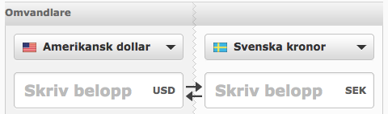

# Currency converter

_This image is meant to explain the functionality_

## Task

Create a small react app that let the user convert an amount between currencies.

This project can be used as a starter. To get started simply clone this repo and run `npm install` and `npm start`

Styling is not important in this test and it's okay to use eg. bootstrap. For your custom styles we encourage you to use [Styled components 💅](https://github.com/styled-components/styled-components)

To get exchange rates you can use [fixer.io](https://fixer.io/). (You need to create an account to get a free access key)

### Desired techniques

- TypeScript
- Styled components

To submit the test, simply push your branch and make a pull request to master.

### Requirements

- You should be able to convert an amount in one currency to another.
- You should be able to change what currencies to convert between.

Good luck!
